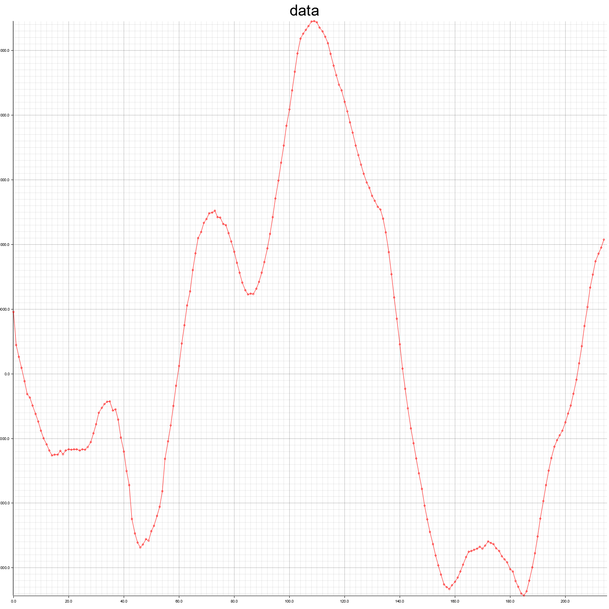

# Robo Depop

A tool to remove single-sample pops from recordings!

## The Journey

This tool was created to "fix" (as much as reasonably possible) a number of
recordings which contain digital corruption in the form of occasional errant
samples. These errant samples are single samples which have significantly
different values than their surrounding samples. An example of a file with this
corruption is included in `docs/trim.flac` and shown in the following image
(note the three points which don't smoothly fit the curve).


> NOTE: The plots shown here are generated in the `plotters` test case in
> `lib.rs`

Several cleanup approaches were tried (which will not be described here) before
a simple algorithm was implemented as described below:

### The Algorithm

1. Prepend two samples to the start of the data, one with maximum possible
   sample value, and one with minimum possible sample value. Add two samples
   with the same values to the end of the data.
2. Iterate over each 5 sample window and
   1. Find the distance between the maximum and minimum values of samples 1,2,4,
      and 5 in the current window (we'll call this value $d$) and the average
      value of these same two max and min samples (we'll call this value $a$).
   2. Check if sample 3 of this window lies outside of $a \pm 2*d$ (two times
      the distance between the max and min away from the average value).
   3. If the value is outside the computed range, replace it in the output with
      the average $a$, else keep the original sample 3 in the output.

This algorithm run on the sample data above produces:



It's not as perfect as someone could get by hand, but it's a whole lot faster to do at scale!

### Productizing

With the basic algorithm working, I attempted to create a VST plugin with this logic using [nih_plug](https://github.com/robbert-vdh/nih-plug). I based my plugin on the "Gain" example provided with `nih_plug` and I was able to create a plugin which works (or at least runs without error) from the command line:

```bash
cargo run --bin robo_depop_plugin_bin -- - p 1056
```

However, after a good deal of experimentation, I could not create a VST3 (dll) version of the plugin which didn't error upon importing (into Audacity or Studio One). To try yourself:

```bash
cargo xtask bundle robo_depop_plugin --release
```

Given these failures, I turned to creating a standalone binary which would process a given file and output a cleaned file. This worked! One issue is that I couldn't find a good library for outputting a flac file, so this script outputs a WAV file which can be re-encoded into a flac file using `ffmpeg`:

```bash
cargo run --bin depop -- -i INPUT.flac -o OUTPUT.wav
ffmpeg -i OUTPUT.wav -c:a flac OUTPUT.flac
rm OUTPUT.wav
```

This works!
